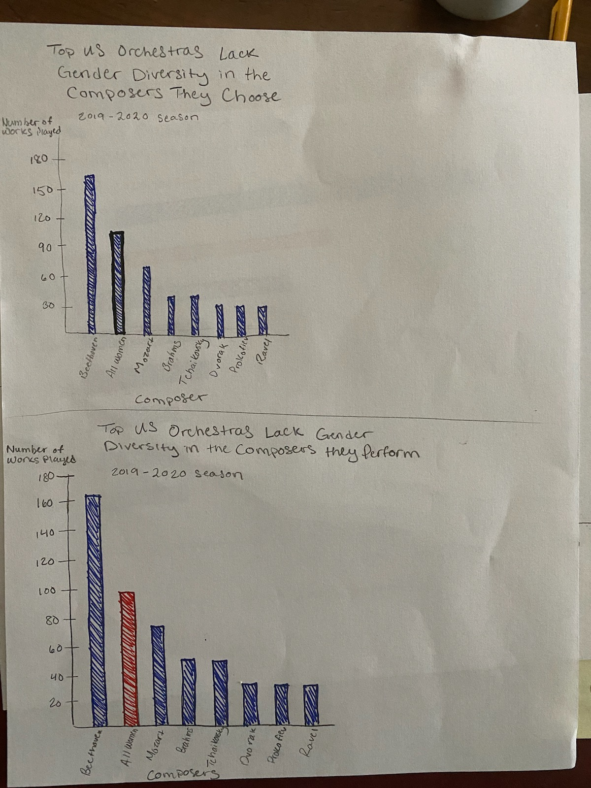

[home page](/README.md)

## Original Data Visualization

Source: Women's Philharmonic Advocacy

## Why I Chose This Visualization
I chose this visualization because diversity in orchestras (including composers, musicians, and conductors) is a huge topic of discussion in the orchestra world, and it's important to analyze data to truly understand the issue. I felt that the message of this pie chart (which is that female composers are underperformed by top US orchestras, and are completely surpassed by Beethoven alone) could have been communicated more clearly and, being that the Women's Philharmonic Advocacy is the only organization I know of that collects this kind of data, I was concerned about how much the audience for this chart truly understands the issue. I wanted to create a visualization that communicates the same message, but in a way that is easier to read and understand. 

## Description of Process
When critiquing this visualization, I realized that the data itself is important, it just wasn't visualized very clearly. Using a pie chart was a good thought, because its simple to understand, so I knew that my redesign should probably be another kind of simple chart. I also realized that the huge amount of color was distracting from the data itself, so I knew my redesign had to have a simple color scheme. Another takeaway I had from the critique was that it was challenging to compare each of the categories, so I knew I wanted to set up my chart in a way to made it easy to see the differences between the composers. 

When doing the wireframes, I started out with a simple bar chart, with the bars in descending order and all one color. I had the y-axis showing number of works performed in increments of 30 and I bolded the "all women" bar to make it stand out. For my second chart, I did mostly the same thing but made the y-axis scale be in increments of 20 to better show the difference between the bars and I made the "all women" bar red to help it stand out more. For my third try, I made the bar chart sideways, so composers were on the y-axis and number of works played was on the x-axis. This made it easier to read the composer names and allowed for easy comparison. I kept the "all women" bar red to make it stand out. My reviewers seemed to understand the data well, and preferred the sideways bar chart and use of red for the women composers. They were curious, though, about the percentage of total works that each composer made up, but I wasn't able to find a way to include that in my redesign. Also, hearing them say what they thought the chart showcased encouraged me to change the title. I feel that the title now better aligns with what the audience sees.

.jpg "Wireframe 2")

My redesign was greatly influenced by my wireframing. I decided to stay with the sideways bar chart, and I also decided to lessen the number of composers included in the chart. I realized that, to communicate the intended message, I didn't actually need every single composer included and that taking some out actually made the chart easier to read. I ended up only including composers who were performed 20 or more times. I also decided to keep the "all women" bar red and make all of the other bars a teal color. The final result, in my mind, is simple, easy to understand, and highlights the amount of times women composers are performed. The overall message is that women composers are underperformed by top US orchestras, and are even surpassed by Beethoven alone.

## My Data Visualization

<iframe src="https://public.tableau.com/views/DataViz3Edited/DataViz3?%3AshowVizHome=no&%3Aembed=true#1:display_count=y&publish=yes&:origin=viz_share_link" width="95%" height="700"> </iframe>
