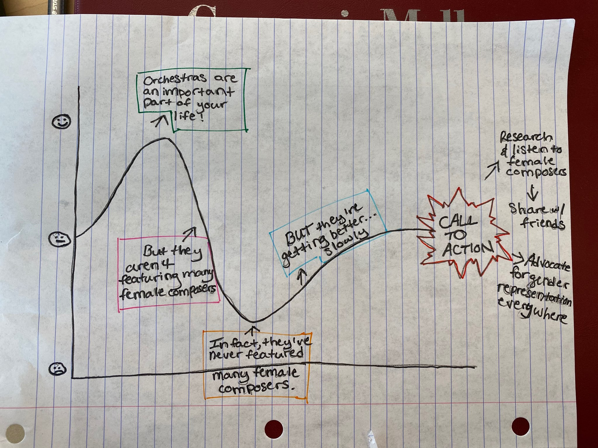

# Outline
For my final project, I want to show that top US orchestras do not feature very many female composers, but are slowly getting better. I hope to encourage my audience to push orchestras to feature more female composers so that the orchestral field can progress, become more relevant to them, and so that diversity, inclusion, and representation will be stronger in their community's art ecosystem.  

I will start out by showing the audience that orchestras are an important part of their lives, whether they realize it or not. There are thousands of orchestras across the country that contribute billions of dollars to our economy. Along with being key contributors the our economy, orchestras are a part of our everyday lives in that they are a part of many of the songs, shows, and movies that we enjoy. Orchestras are in our lives in many ways, so the decisions they make and the actions they take impact us all. With this message, I hope to draw the audience in and convince them that my story is important to their life.

I then want to open the audience's eyes to some concerning decisions that orchestras make in terms of the composers they choose to feature. This is where I will show that, in this past season, orchestras featured far more male composers than female composers, leaving female voices significantly less heard and less involved in the progression of orchestral music.

I then want to show the audience that this was not an isolated event. In the past few years, orchestras have consistently featured far more male composers than female composers. The good news is, though, that orchestras are  getting better; but only very slowly.

At this point, the audience may be wondering if the disparity between male and female composers is because there aren't many female composers to choose from. I will show them that there is in fact a huge number of female composers to feature; orchestras are just failing to choose them. 

By this point, I hope to have the audience wondering why ochestras choose to feature so few female composers. I hope to have them question how much orchestral music is really progressing if they fail to be inclusive and diverse. This will bring me to my call to action, which will be for the class to listen to and support female composers, demand that orchestras be more inclusive, and support gender representation in all corners of their community. I will provide them with links to websites where they can find out more about female composers and listen to their music, such as the Women Composers Database, and encourage them to share their support publicly with the hope that the message will spread.

# Initial Sketches

# The Data
### List of Orchestras
I will create a spreadsheet of US orchestras by compiling information from a Wikipedia list of orchestras, as well as a list of orchestras who are members of the League of American Orchestras.

[Wikipedia](https://en.wikipedia.org/wiki/List_of_symphony_orchestras_in_the_United_States)

[League of American Orchestras](https://americanorchestras-fontevacustomer.force.com/s/searchdirectory?id=a3I0b000003TXsm)

### Orchestra Repertoire
I will use this data to show how few females were featured in the most recent season, and then compare the male to female ratio over the past few seasons.

[2019/2020 Season](https://wophil.org/2019-2020-season-follow-up/)

[2018/2019 Season](https://wophil.org/2018-19-season-by-the-numbers/)

[2017/2018 Season](https://wophil.org/2017-18-season-by-the-numbers/?doing_wp_cron=1581194906.7084059715270996093750)

[2016/2017 Season](https://wophil.org/works-by-women-in-the-2016-2017-season/?doing_wp_cron=1581194961.8673739433288574218750)

[2014/2015 Season](https://www.bsomusic.org/stories/the-orchestra-season-by-the-numbers-database.aspx)

### Female Composers Available
I will use the data from this database to show that there is a large number of female composers available for orchestras to feature.

[Female Composers](https://www.composerdiversity.com/)

# Method and Medium
