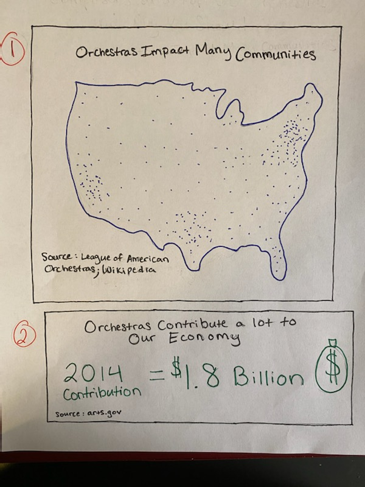
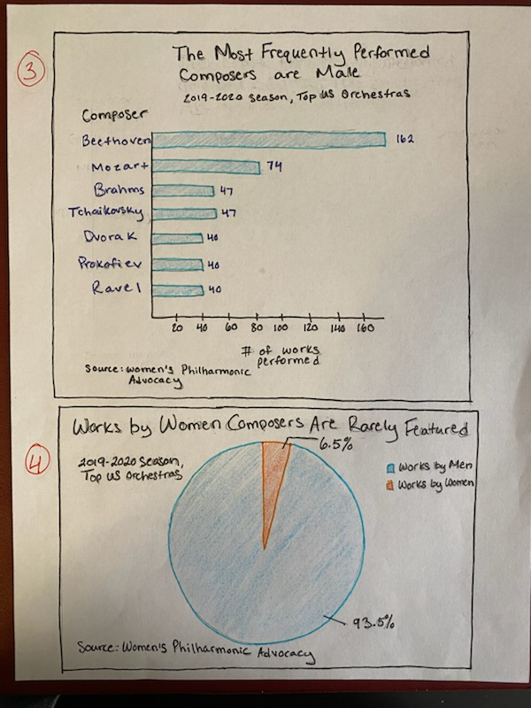
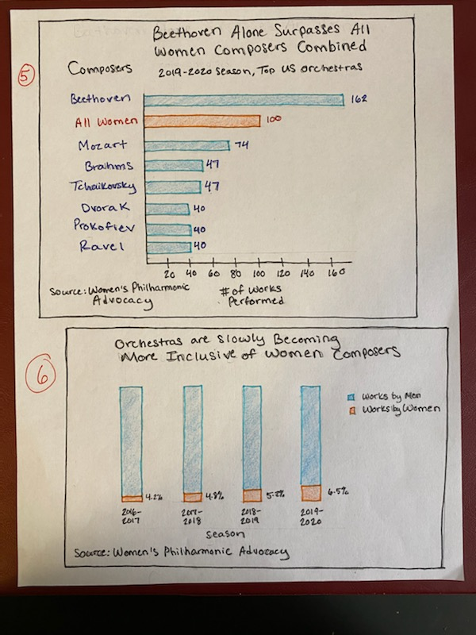
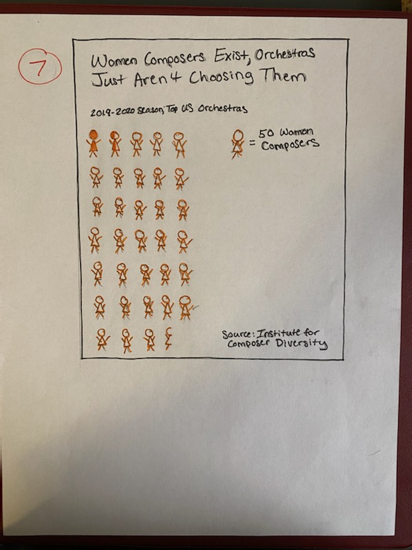

# Initial Storyboard

# Initial Wireframes

# User Research Protocol

### Target Audience
The target audience I hope to reach with this story is the general public, specifically millenials with a wide range of orchestra knowledge. I would like the general population to be aware of and care about the issue of gender representation of composers, and I'd like to inform them of ways to improve the situation, no matter their level of involvement in the arts.

### Identifying Individuals to Interview
With the target audience in mind, I gathered 3 individuals in their early 20s (2 male, 1 female) with a range of orchestra knowledge. One individual attended music school and currently works in the arts sector, another was involved in orchestra and band in their childhood but has little involvement today, and the other has very little experience or knowledge of classical music.

### Interview Script

Relevance of Information
1. Did you know this information before seeing these visualizations?
2. Were you surprised after seeing these visualizations?

Emotional Appeal

3. How do you feel after seeing these visualizations?

Comprehension

4. Do you have any questions about this data?
5. Were any of the visualizations confusing?

Intention

6. Would you advocate for greater representation of female composers after seeing this?

Improvement

7. Is there anything you would change about this story? 

### Interview Findings

Person 1 Responses

1. I was generally aware of the information before seeing the visualizations, but I was unaware of the percentages on each visualization. The numerical data was shocking, especially the numbers on visualizations 4 and 6.

2. Honestly, the visualizations made me a little sad, just because so many people are unaware of the importance of orchestras in our communities and representation of those communities in orchestras. I wish more people could look at them, specifically people in charge of these orchestras so somebody can feel as shocked as I felt and feel more compelled to make a change. 

3. No questions! None of them were confusing

4. Absolutely.

5. Is there any relevant data about where women composers are being programmed more frequently based on the communities the orchestras are in? Could you add anything about the types of communities and groups of people (demographically? age group, economic status) orchestras impact/should impact the most to accompany your first visualization? Can you use the word "programming" instead of "choosing" in your last sketch? I really like your color choice.

Person 2 Responses

1. I did not know this information before seeing the visualizations. I wasn’t that surprised though, I could definitely see this being an issue in the arts.

2. I'm shocked

3. The only visualization I thought was confusing was slide 7. Just to make sure I’m understanding, each non-filled in woman = 50 women composers, and the filled in ones are the number that orchestras are choosing? I’m pretty sure I’m reading it correctly but it took a second look and some more thought. To really make the data tell a good story you need to make it super clear what It’s showing, like no brain power at all, to reach the general public. If it takes too much energy they’ll likely skip over it I feel like. This also might be better when you’re using a computer and not drawing stick figures.

4. Absolutely.

5. I have some thoughts about the titles of your slides.

#1: Orchestras impact communities across the nation 

#2: orchestras contribute significantly to our economy 

Is this the end of the story? What are we gonna do about this? Where do we go from here? I’d add one more slide to kinda wrap it up. Or do a call to action, if this project allows for something like that.

Person 3 Responses

1. I did not know already know this information, but I assumed something like this was the reality. 

2. I am interested in knowing more about the underlying cause of this issue. Is it because orchestras mostly choose music from a time when women weren't allowed to be composers?

3. My main question is, when were the most frequently played compositions written? Are they all from a certain era?

4. Yes. And I feel that knowing some of the underlying causes will allow for better advocacy.

5. I would add something in about when the pieces were written, or maybe if the most frequently chosen composers are living or dead. I think that adds a lot of value to the message.

### Changes to storyboard and wireframes

I like person 1's suggestion about showing which orchestras (if any) are successful at showcasing women composers to prove that it is feasible to do so, but I feel that it may take some time to find that data so I'm keeping it on my change list as a maybe. I will take their suggestion to use the word programming instead of chosen. I will make the final visualization clearer by stating in the 2019 - 2020 season, orchestras chose only a small percentage of all the women composers that are out there. I also like person 2's suggestions for the titles, so I will adapt those. I like person 3's thoughts on showing whether the most frequently chosen composers are living or dead, and I agree that continuing to choose composers from the 1800's is part of the gender representation problem. If I have the time, I will try to add that element to my dataset and create either a separate chart or label an existing chart(s) to show how that is part of the problem. 

# Revised Storyboard and Wireframe

<iframe src="https://public.tableau.com/views/Map_15818068026740/Map?:showVizHome=no&:embed=true " width="95%" height="700"> </iframe>

.png)

<iframe src="https://public.tableau.com/views/Graph3_15818164880480/Graph3-MostPlayedComposers?:showVizHome=no&embed=true" width="95%" height="700"> </iframe>

<iframe src="https://public.tableau.com/views/Graph4EDITED-RatioPieChart/Sheet1?:showVizHome=no&embed=true" width="95%" height="700"> </iframe>
